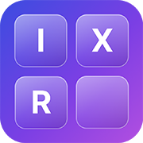

# IT-Deck



Self-hosted universal control surface that turns an old iPhone into a deck
for your PC.

*(Screenshots to be added — capturing them requires a live device, out of
scope for this edit.)*

## What it does

The dashboard (phone) shows a grid of tiles; tapping one sends a command to
the Windows agent, which executes it and reports back within 5 seconds.
Long-pressing a tile opens a context menu with a "Force Stop" option for
killing a stuck process.

Of the 10 tiles currently in the catalog, 7 are wired to a real command:

- **Terminal** — launch an app (demo config currently opens Notepad)
- **Mic** — mute/unmute the microphone; turns red while muted
- **Volume** — drag to set system output volume
- **Headphones** — mute/unmute speaker output
- **Audio Switch** — swap between two configured output devices
- **Screenshot** — capture the PC's screen and view it from the phone
- **VPN** — start/stop a configured VPN client process

The remaining 3 (**Lights**, **Spotify**, **Sleep PC**) are still
placeholder tiles left over from the very first prototype and aren't wired
to a working command yet.

**Studio Mode** (`/studio.html`) is a separate desktop-only admin page for
editing the tile catalog directly (add/edit/delete tiles) — the phone
dashboard itself never mutates the catalog.

## Requirements

- A Debian/Linux server (or any Docker host) to run the backend container
- A Windows PC to control — the agent depends on `pycaw`/`comtypes`
  (Windows COM audio APIs), so it only runs on Windows, by design
- An iPhone or any modern phone with a browser — it's a PWA served over
  plain HTTP on the LAN, not a native app

## Setup

1. Clone this repo onto the server that will run the backend:
   ```
   git clone <repo-url>
   cd controlhub
   cp .env.example .env
   ```
   Fill in `.env` — at minimum `AGENT_TOKEN` (a shared secret the Windows
   agent and Studio Mode both need) and `SERVER_PORT`.
2. Start the backend:
   ```
   docker compose up -d --build
   ```
3. Copy (or clone) `agents/windows/` onto the Windows PC being controlled:
   ```
   cd agents/windows
   pip install -r requirements.txt
   cp .env.example .env
   ```
   Fill in `SERVER_IP` (the backend server's LAN IP), `SERVER_PORT`,
   `AGENT_TOKEN` (same value as the backend's), and the audio/VPN values
   for your own hardware — see the comments in `.env.example`.
4. Run the agent once manually to confirm it connects:
   ```
   python agent.py
   ```
   Then register it to start automatically at login:
   ```
   powershell -File install_task.ps1
   ```
5. On the phone, open `http://<server-lan-ip>:8000` in the browser and add
   it to the home screen.

## Architecture

Three pieces, each holding one persistent WebSocket: a **backend**
(FastAPI + SQLite, deployed as a single Docker container on the Debian/Linux
host) that serves the REST snapshot endpoint, the static frontend, and both
WebSocket routes; a **Windows agent** that runs on the controlled PC, holds
a persistent connection to the backend, executes incoming commands, and
polls local state (e.g. mic mute) on a timer; and a **frontend** — a
build-step-free vanilla JS/CSS PWA served straight off disk — that runs in
the phone's browser and talks to the backend over its own WebSocket.

```
backend/app/
├── main.py        FastAPI app, route registration, startup fixups
├── db.py          sqlite connection, schema, seed/fixup migrations
├── models.py      Item/Workspace pydantic models, query helpers
├── state.py       in-memory current-state snapshot + diffing
└── ws/
    ├── hub.py      ConnectionHub: tracks connected clients/agents, broadcast
    ├── agent.py    /ws/agent handler — agent hello/auth, state, results
    └── client.py   /ws/client handler — initial state push, execute cmd

agents/windows/
├── agent.py       connects to backend, reconnect/backoff loop, dispatches
│                  incoming commands to handlers, forwards polled state
├── poller.py      polls local state (mic mute) on an interval, pushes it
└── handlers/      one module per command type (audio.py, process.py)

frontend/
├── index.html
├── js/
│   ├── app.js     boot: fetch workspace, initial render, wire clicks
│   ├── api.js     REST fetch + params JSON parsing
│   ├── ws.js      client WebSocket: connect/reconnect, send execute, result callbacks
│   └── render.js  DOM rendering: grid, tiles, error/empty states
└── css/           base.css, grid.css, button.css
```

See `CLAUDE.md` for the full architecture reference — message shapes,
platform constraints, and known limitations.

## Status

v0.1 — personal project, active development, API may change.
